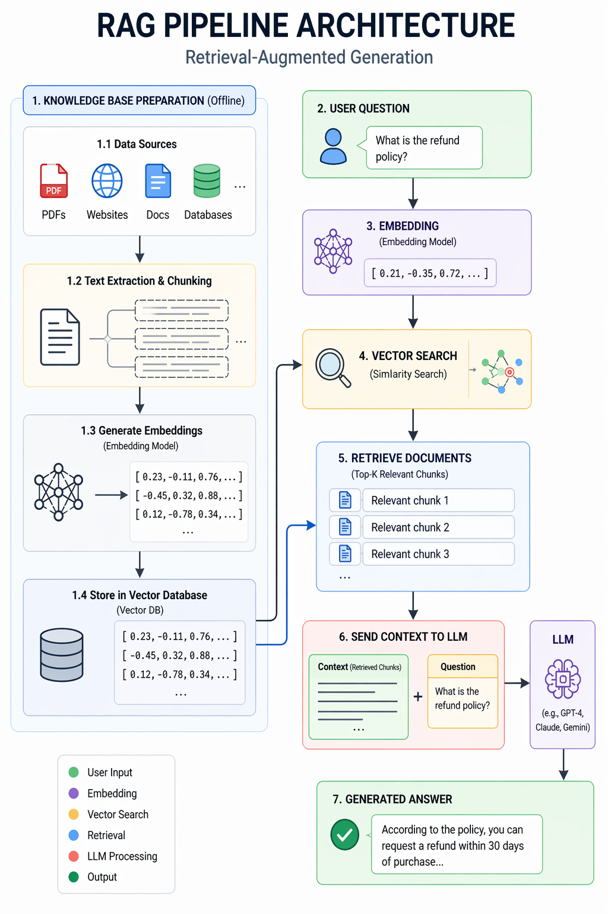

# What is RAG (Retrieval Augmented Generation)?

**RAG = Retrieval + AI Generation**

It is a method that lets an AI search for information *first* and then generate an answer using that information.

Instead of relying only on what the model learned during training, it looks up real data before answering.

## Simple Example

Imagine you ask an AI:

*"What are the rules of my college?"*

A normal AI might say:

❌ "I don’t know your college rules."

Because it was never trained on your college documents.

But with RAG, the system works like this:

1️⃣ It searches your college documents
2️⃣ Finds the relevant rule section
3️⃣ Sends that to the AI model
4️⃣ The AI generates the final answer

So the answer becomes:

✅ "According to the HKBK handbook, attendance must be above 75%."

## Think of RAG like an Open Book Exam

**Normal LLM:**
🧠 Uses memory only

**RAG system:**
📚 Looks into the book first
🧠 Then answers using that information

---

## The RAG Pipeline (Step by Step)

Here is how RAG works internally.

### Step 1 — Store Knowledge

You upload documents like:
* PDFs
* Website content
* Databases
* Company documents

**Example:**
* College Rules PDF
* Attendance Policy
* Student Handbook

### Step 2 — Convert Text to Embeddings

The text is converted into vectors (numbers) using an embedding model.

**Example:**
"Attendance must be 75%"
↓
`[0.234, 0.887, 0.121, ...]`

These vectors help the system understand meaning.

### Step 3 — Store in a Vector Database

These vectors are stored in databases like:
* Pinecone
* Weaviate
* Chroma
* FAISS

These databases help find similar information quickly.

### Step 4 — User Asks a Question

**Example:**
"What is the minimum attendance?"

### Step 5 — Retrieval

The system searches the vector database and retrieves the most relevant document chunks.

**Example retrieved text:**
"Students must maintain 75% attendance to appear for exams."

### Step 6 — Send to LLM

The retrieved context is sent to the LLM like:
* OpenAI models
* Anthropic models
* Google Gemini

**Prompt example:**
`Context: Students must maintain 75% attendance.`
`Question: What is the minimum attendance?`

### Step 7 — AI Generates Answer

The LLM now generates a more accurate answer:

"The minimum attendance required is 75%."

---

## One-Line Definition

RAG is a technique where AI retrieves relevant information from a database and then generates an answer using it.

## Why RAG is Powerful

**Without RAG:**
❌ AI hallucinations
❌ Cannot access private data
❌ Knowledge cutoff problem

**With RAG:**
✅ Uses your documents
✅ Up-to-date information
✅ More accurate answers

## Real-World Examples of RAG

RAG powers systems like:
* Company internal chatbots
* Customer support AI
* Legal document assistants
* Research assistants
* Coding assistants

**Example:**
ChatGPT with your PDFs = RAG

## Simple Architecture

## Example RAG Use Case You Could Build

Since you're interested in AI projects, you could build:

**College AI Assistant**

Students ask:
* "What is the attendance rule?"
* "When is the semester exam?"
* "How to apply for leave?"

RAG searches:
* College PDF
* Department rules
* Circulars

And answers instantly.

*This would actually fit perfectly with your Smart Attendance System project.*

## Tools Used in RAG Systems

**Typical stack:**

* **LLM** → OpenAI / Anthropic / Google
* **Embeddings** → OpenAI Embeddings / Sentence Transformers
* **Vector DB** → Pinecone / Chroma
* **Frameworks** → LangChain / LlamaIndex

---

## The Simplest Way to Remember RAG

**RAG = Google Search + ChatGPT**

1. Search first
2. Generate answer later
