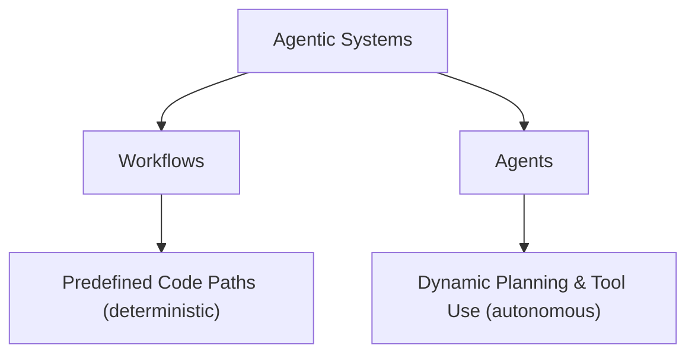

# Building Effective AI Agents

This document is a comprehensive, developer-focused guide and summary of Anthropic's research and practical insights on building reliable, effective AI agents and workflows. 

**Source Article:** [Building effective agents - Anthropic (Dec 19, 2024)](https://www.anthropic.com/engineering/building-effective-agents)

---

## 1. Workflows vs. Agents: Key Distinctions

Anthropic categorizes all LLM-based systems under the umbrella of **agentic systems**, but draws an important architectural boundary based on where control resides:

*   **Workflows:** Systems where LLMs and tools are orchestrated through predefined, programmatic code paths. 
*   **Agents:** Systems where the LLM dynamically directs its own processes, schedules tool usage, and controls how it accomplishes tasks.

### Comparison Table

| Attribute | Workflows | Agents |
| :--- | :--- | :--- |
| **Control Flow** | Deterministic / Hardcoded | Dynamic / LLM-driven |
| **Predictability** | High | Low (non-deterministic) |
| **Latency & Cost** | Low to Moderate | High (multiple reasoning loops) |
| **Debugging Complexity** | Low (standard software testing) | High (requires sandboxing & prompt evals) |
| **Best Fit For** | Well-defined, step-by-step tasks | Open-ended, unpredictable problems |

---

## 2. Practical Strategy: When to Add Complexity

> [!IMPORTANT]
> Always find the simplest solution possible first. Only increase complexity when it demonstrably improves performance on your evaluation datasets. 

1. **Single LLM Call:** Start here. Optimize using retrieval-augmented generation (RAG), few-shot in-context examples, and clear system instructions.
2. **Workflows:** Transition here if your task has clear, structured subtasks that can be handled sequentially or in parallel. Workflows offer predictability and consistency.
3. **Agents:** Transition here only if the problem is open-ended, and it is impossible to hardcode a fixed sequence of steps. Agents trade latency and cost for autonomous adaptability.

---

## 3. The Framework Dilemma

Several specialized frameworks exist to simplify agentic systems, such as:
*   **Claude Agent SDK**
*   **Strands Agents SDK by AWS**
*   **Rivet** (Drag-and-drop GUI workflow builder)
*   **Vellum** (GUI tool for building/testing LLM workflows)

> [!WARNING]
> While frameworks are helpful for quick prototyping, they introduce heavy abstractions that obscure underlying prompts and responses. This makes debugging difficult and prompts developers to overcomplicate simple architectures. 
> 
> **Recommendation:** Start by using raw LLM APIs directly. A few lines of code can implement most patterns. If you use a framework, ensure you fully understand its underlying codebase.

---

## 4. Foundational Building Block: The Augmented LLM

The basic unit of any agentic system is an **Augmented LLM**: an LLM model enhanced with:
*   **Retrieval (RAG):** Providing search queries to fetch external documents.
*   **Tools:** APIs that execute actions or fetch real-time state.
*   **Memory:** Short-term context or long-term vector/stateful stores.

One approach to standardized integration is the **Model Context Protocol (MCP)**, allowing clients to plug-and-play into an ecosystem of tools.

---

## 5. Five Orchestration Workflows

### A. Prompt Chaining
Decomposes a complex task into a sequence of steps, where each LLM call processes the output of the previous one. Programmatic "gates" can validate intermediate states.

*   **When to use:** When the task can be easily split into fixed, sequential subtasks.
*   **Example:** Generating marketing copy $\rightarrow$ Translating to French $\rightarrow$ Checking alignment with brand guidelines.

### B. Routing
Classifies an input query and directs it to a specialized downstream handler, prompt, or model.

*   **When to use:** When different categories of inputs require completely different prompts or models.
*   **Example:** Routing support tickets: general questions $\rightarrow$ cheap model (Haiku); complex bugs $\rightarrow$ capable model (Sonnet).

### C. Parallelization
Executes multiple LLM operations simultaneously and aggregates their outputs programmatically.
1.  **Sectioning:** Splitting a large task into independent chunks run in parallel.
2.  **Voting:** Running the same query multiple times to check consensus and reduce hallucination.

*   **When to use:** When tasks are independent or speed is critical.
*   **Example:** Security code analysis where different prompts flag different vulnerabilities in parallel.

### D. Orchestrator-Workers
A central coordinator LLM analyzes the input, dynamically generates subtasks, delegates them to worker LLMs, and synthesizes the results.

*   **When to use:** When the exact subtasks cannot be predicted beforehand, and depend dynamically on the input.
*   **Example:** Writing a software pull request (where the orchestrator determines which files need to be changed and delegates the specific edits).

### E. Evaluator-Optimizer
An iterative feedback loop where a generator LLM creates a draft, and an evaluator LLM reviews it and provides feedback for the generator to refine the draft.

*   **When to use:** When you have clear, objective evaluation criteria and quality increases significantly with multiple iterations.
*   **Example:** Complex translation, writing detailed research papers, or formal document generation.

---

## 6. Autonomous Agents

Agents operate in a dynamic loop, using tools to interact with their environment and adapting their plans based on the feedback received.

*   **Execution loop:** The agent gains "ground truth" (such as database query results, compile logs, or shell execution output) at each step to check its progress.
*   **Stopping conditions:** Agents need clear termination conditions (e.g., maximum iterations) to prevent runaway loops.
*   **Safety & Sandboxing:** Execute agents in secure, isolated sandboxes to prevent data loss or unauthorized system access.

### Real-World Example: Coding Agent
Anthropic's coding agent solves issues on the **SWE-bench Verified** benchmark based on pull request descriptions.

---

## 7. Appendix 1: Promising Domains for Agents

Anthropic identifies two domains where agents are providing high commercial value:

1.  **Customer Support:** Combines standard chatbot dialogue with active tools (pulling user data, updating order history, or triggering refunds) and has clear, user-defined success parameters.
2.  **Coding Agents:** A structured, objective problem space. Code solutions are highly verifiable via automated tests, allowing the agent to use test failures as direct feedback loops.

---

## 8. Appendix 2: Prompt Engineering Your Tools (ACI)

Creating a great **Agent-Computer Interface (ACI)** is as important as writing the core system prompts.

### Format and Overhead Guidelines
*   **Give the model room to think:** Allow the model to output a step-by-step reasoning chain *before* it generates a tool call.
*   **Keep formats natural:** Align tool inputs/outputs with text structures common on the internet (e.g., standard Markdown is easier for LLMs than escaping code inside a complex JSON string).
*   **Reduce formatting overhead:** Avoid tools that require the model to calculate line counts in headers (like diff tools) or construct intricate nested objects if simpler raw text formats work.

### HCI to ACI Best Practices
*   **Think like the model:** Is it obvious how to use this tool, or does it require subtle assumptions? Add example usage and edge cases in the tool description.
*   **Write clear docstrings:** Treat parameter names and tool descriptions like a detailed docstring written for a junior developer.
*   **Poka-yoke (Error-proofing):** Design tools so they are structurally difficult to misuse.
    *   *Real-World Case Study:* During SWE-bench development, Anthropic found that agents struggled with tools using relative paths when changing directories. To fix this, they modified the tools to **exclusively require absolute filepaths**, completely eliminating path resolution errors.
